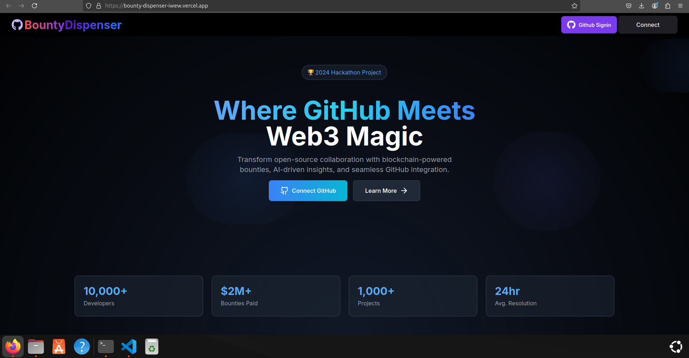

# Open-Source Bounty Dispenser

The **Open-Source Bounty Dispenser** is a platform designed to transform how open-source contributions are rewarded. By integrating blockchain technology with GitHub, it provides a seamless experience for maintainers to assign and manage bounties for project issues. Contributors can track their progress, and receive secure payouts.. Our platform ensures fair, transparent, and efficient rewards, making open-source development more engaging and rewarding for all.

## Proposed Solution

This platform that connects blockchain and GitHub to automate and simplify bounty management.. Key features include:

- **Blockchain-Enabled Bounty Management**: Secure and transparent transactions for assigning and receiving bounties using blockchain technology.
- **Seamless Integration with GitHub**: Easy integration with GitHub, allowing project maintainers to link issues directly to bounties and track contributors' progress.
- **Automated Bounty Allocation**: Bounties are automatically assigned to contributors based on issue completion, streamlining the reward process.
- **Contributor Registration and Verification**: Contributors are required to register and verify their identity for added credibility and to ensure fair payouts.
- **Real-Time Dashboard**: Both maintainers and contributors can track bounty progress and funds through a real-time dashboard.
- **Increased Credibility**: Blockchain's transparency ensures all transactions are verifiable, fostering trust in the bounty management process.

## Features

- **Open-source Contribution Rewards**: Facilitate the reward process for open-source contributors by tracking their work and ensuring timely payouts.
- **Real-Time Bounty Tracker**: A dynamic dashboard to monitor ongoing and completed bounties.
- **Smart Contracts for Secure Transactions**: Ethereum-based smart contracts to handle bounty payouts securely and automatically.
- **GitHub Issue Integration**: Directly link bounties to GitHub issues for easy tracking of tasks and payments.

## Technologies Used

### Full Stack:
- **Next.js**: A React framework for building the front-end and back-end of the platform.
- **TypeScript**: A superset of JavaScript for better development experience and type safety.
- **Tailwind CSS**: A utility-first CSS framework for building custom designs without writing custom CSS.
- **Thirdweb**: A framework for integrating Web3 and blockchain technologies in a decentralized way.


## Installation

To get started with the Open-Source Bounty Dispenser platform, follow these steps:

### Prerequisites:
- Node.js (v16 or higher)
- PostgreSQL

### Steps:
1. Clone the repository:
   ```bash
   git clone https://github.com/Maman08/Bounty-Dispenser.git

2. Install Dependencies
   ```bash
   cd Bounty-Dispenser
   npm install


3. Set up environment variables    
   
    NEXT_PUBLIC_TEMPLATE_CLIENT_ID=your-client-id
    GITHUB_ID=your-github-id
    GITHUB_SECRET=your-github-secret
    NEXTAUTH_SECRET=your-nextauth-secret
    NEXTAUTH_URL=http://localhost:3000
    MONGODB_URI=your-mongodb-uri


# thirdweb-next-starter
## Installation

```bash
  npx thirdweb create app --next
```

## Environment Variables

To run this project, you will need to add the following environment variables to your .env file:

`CLIENT_ID`

## Run locally

Install dependencies

```bash
yarn
```

Start development server

```bash
yarn dev
```

Create a production build

```bash
yarn build
```

Preview the production build

```bash
yarn start
```




